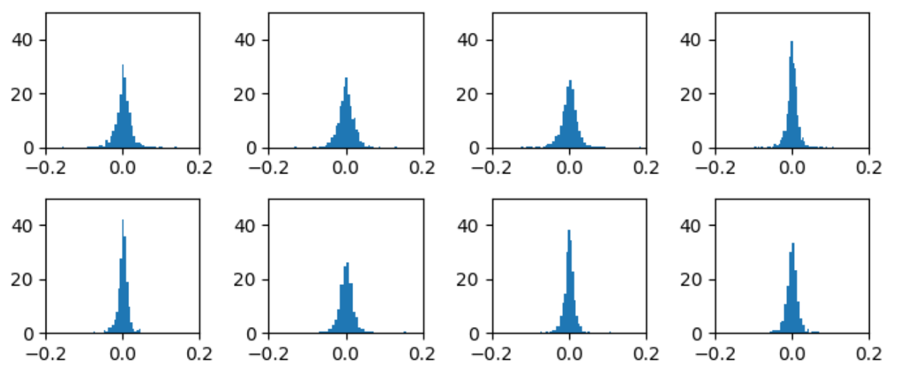
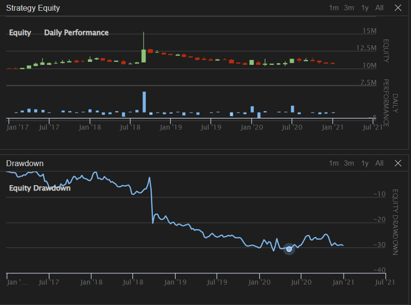
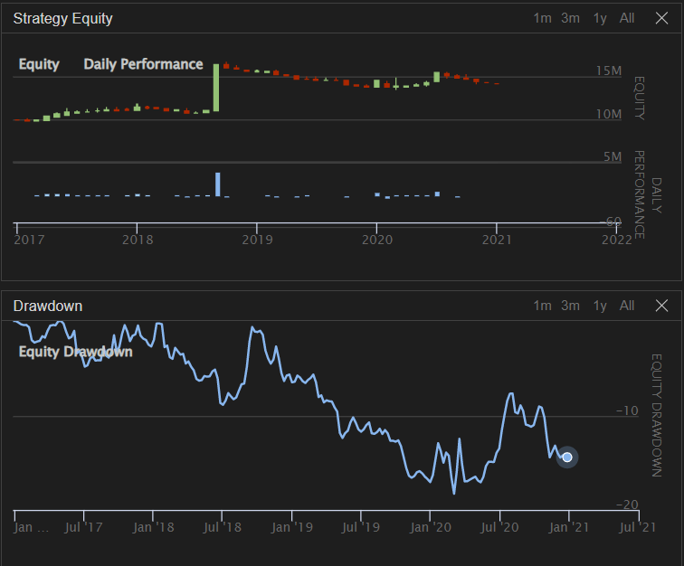
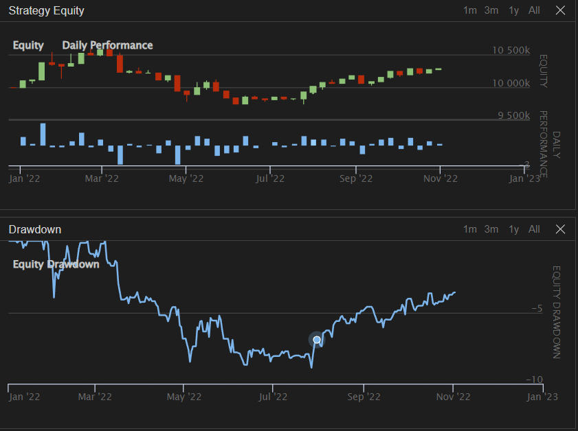
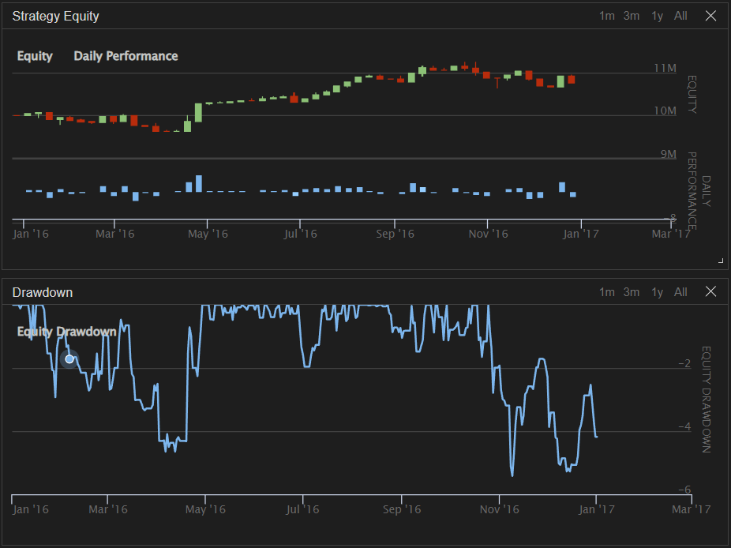
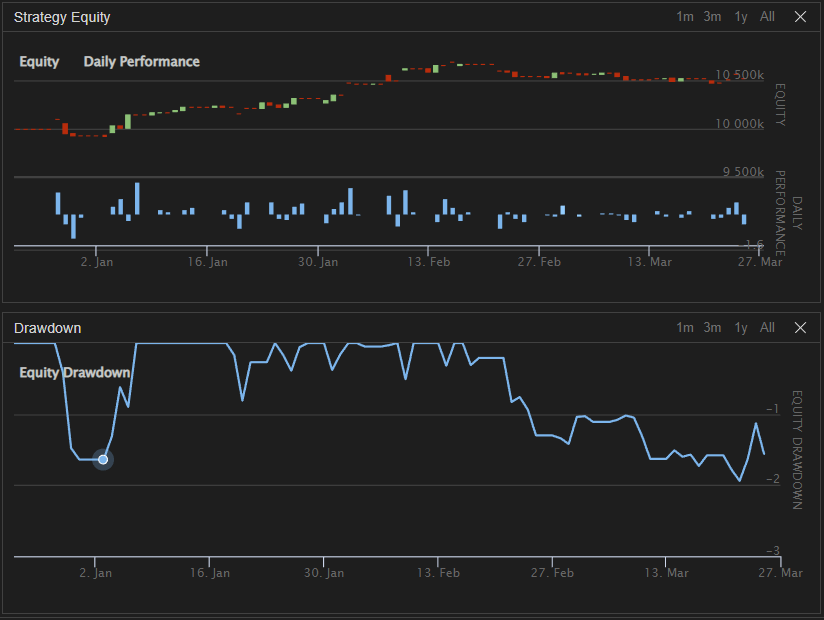
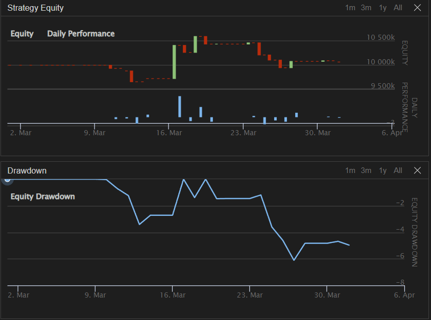
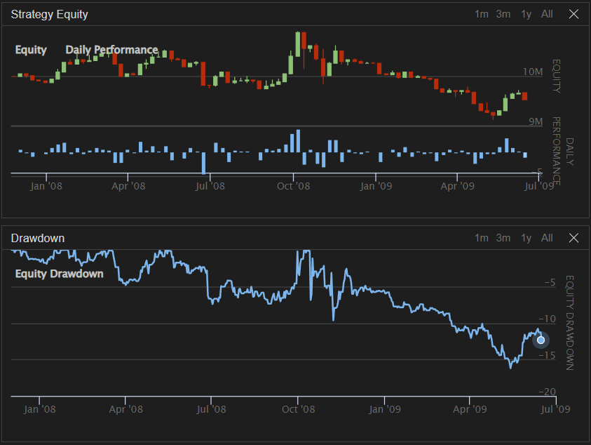
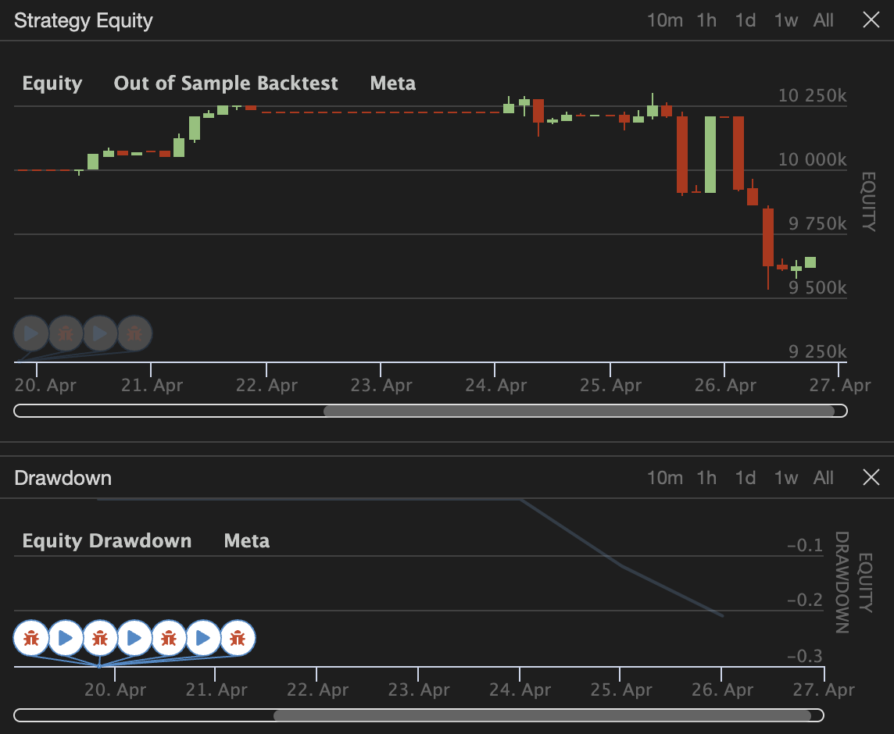

# Quant-Finance

## Tree-based strategies on QuantConnect (Lean-based open source trading platform).

This writeup presents a novel approach to algorithmic trading that combines fundamental universe selection, regression using Gradient Boosting, linear programming to choose portfolio weights, and rigorous risk management controls to optimize portfolio performance. Our methodology involves selecting a subset of stocks from a large universe of U.S. equities based on fundamental criteria such as earnings, debt, and valuation metrics. We then use Gradient Boosting to predct returns the selected stocks as either buys or sells based on their expected performance. To construct an optimal portfolio, we use a linear programming model that maximizes the Sharpe Ratio while imposing constraints on risk and exposure. Our results show that the proposed approach outperforms the market during periods of economic crisis but underperforms during bull markets. Furthermore, we demonstrate the effectiveness of our risk controls in mitigating tail risk and preserving capital during market downturns. Overall, our findings suggest that incorporating fundamental universe selection, Gradient Boosting, linear programming, and risk controls can lead to superior investment outcomes with algorithmic trading during bear markets.

### Algorithm

#### Fundamental Selection Criteria

Though there is significant debate in the academic and investing communities about whether or not it is
possible to generate abnormal returns, we believe a necessary tool to accomplish this is the use of fundamental
indicators to remove stocks that have undesirable properties. We will use a slightly modified version of a
Benjamin Graham [4] or Warren Buffett-style criteria:

* Market Cap > $300MM
* Price > $5 / Share
* P/E < 100
* Price / Earnings to Growth (PEG) < 3
* Debt / Equity < 2
* Current Ratio > 1

We are, of course, leaving out any consideration for dividends as we are more interested in growth of
the stock rather than dividend income. If dividends are paid out, they are not being reinvested into the
company and thus limits growth of share price. Piotroski gives evidence that identifying firms with high
book-to-market value (BM) can provide a market-beating edge of up to 7.5%[7], though we found that this
constraint limited our universe of stocks to only 3 or 4 and deemed it too restrictive. Thus, our goal is to
provide a starting point that is not too restrictive that will later allow us to make the stocks more easily
separable into winners and losers. Our reasoning for the criteria is as follows: a market cap > $300MM will
assure a large enough volume that there is enough liquidity to make trades on the stock, a price > $5 will
eliminate potential penny stocks, a P/E Ratio <100 will ensure that the company is not overvalued to an
extreme degree, a PEG Ratio < 3 indicates the stock has a high chance for growth, a debt to equity ratio
< 2 will avoid us choosing over-levered companies, and a current ratio > 1 ensures the company is able to
meet its short-term liabilities.
Additionally, a dynamic universe selection avoids selection bias and survivorship bias of stocks. Since
companies can be delisted over time, either voluntarily or involuntarily, it would introduce bias if we made a
pre-determined list of stocks that were currently trading. For example, if we selected MSFT, GS, and JPM
as stocks to trade, since they “survived” to the current day, it is biased against stocks that traded in the
past but were delisted.
In our algorithm, this is accomplished in `SelectCoarse()` and `SelectFine()`, which are passed into
`self.AddUniverse()` to dynamically create the active universe of securities that we will consider for trading.
The initial universe considered in coarse filtering is the US Equity Security Master dataset provided by
QuantConnect, which contains about 27,500 equities. The only parameter that is coarse filtered is the
price of the stock. The rest of the properties, like the PE Ratio or Current Ratio are accessed in the
Morningstar US Fundamental Data dataset. Since we have limited resources to train the Boosting model and
we train the model on each security, we then select a maximum of 10 securities after fine filtering to consider
trading. Universe selection is computationally intense, so to preserve RAM, we only perform selection on the
first day of the month. With more resources, we believe more frequent selection would provide additional
diversification benefits. We also utilize the QuantConnect event handler OnSecuritiesChanged() which
triggers when securities move in and out of the universe. We found it particularly difficult to accurately
retrieve the securities in the active universe, so we implemented code to manually keep track of them.

#### Gradient Boosting

* Decision Trees
* Gradient Boosting 
* Features (Data Aggregation)

### Historical Price & Indicators

The methods of accessing data are somewhat different across different QuantConnect datasets which provided
significant hurdles. Utilizing `self.History(ticker, lookback)` retrieves data with a lookback based on
self.Time which, during backtesting, is the historical time from `Initialize()`. However, historical data
of indicators, like RSI, etc., are not available with a self-based method and are only accessible by using a
QuantBook object from the research environment in main.py. However, we discovered after implementing a
QuantBook-based approach that it used a significant amount of memory that caused backtesting to crash.
Thus assessing model performance over the given backtest period became difficult. One approach we came
upon was to dice the backtest period into multiple time chunks and aggregate PnL statistics to assess the
overall model performance. However, due to the complexity of compounding Sharpe ratios and managing
unliquidated positions at the start of each backtest chunk, we aborted this approach. After investigation, we
determined that QuantBook objects are only appropriate for research environments. To get the indicators,
we manually calculated them in custom functions `bollinger_bands()` and `calculate_rsi()`.

We then have three scenarios for which we need to access data: training the model, backtesting the model,
and live trading. To accomplish this, `get_all_data()` takes boolean arguments for historical, backtesting,
and training. This divides the data retrieval into the appropriate time frame and lookback period. At a
daily resolution, and for each stock, this gives us close, high, low, open, and volume. Then, we perform some
calculations to pull in additional features like average gain, average loss, and bandwidth. For training, the
function retrieves data for a predetermined lookback period. For backtesting, the function creates a data
frame with one column containing the newest data on every trading day. For live trading, it gets all the realtime
data from the market. Last, we use the retrieved data frame to create 5-day lags of the indicators with
the Pandas `pd.shift()` function. Suppose the original indicator data frame has 50 rows and 14 columns.
The lag function would create a data frame with 50 rows and 70 columns so that each data point contains
information for today as well as the past 4 days.

### Sentiment Analysis

QuantConnect provides access to datasets provided by Tiingo, a news and data aggregation service. To access
this in our algorithm, we use the same historical approach as the indicators and add a subscription to the
news source symbol. The resulting `TiingoNews` object includes data like `source`, `Url`, `PublishedDate`,
`Description`, and `Title` for articles published during our lookback period. Using Python’s `nltk` library,
we performed sentiment analysis on the titles of all articles published in a day (since our resolution was
daily) then combined them and appended to the main data frame. In Souza et. al., they note that ”Twitter
sentiment has a statistically-significant relationship with stock returns and volatility” and that ”surprisingly,
the Twitter’s sentiment presented a relatively stronger relationship with the stock’s returns compared to
traditional newswires.” [10] Since Twitter API access has been changed recently, and Tiingo data was freely
accessible through QuantConnect, we hope that our news data analysis can perform similarly though note
that Twitter sentiment data would likely provide superior performance. The analysis in the literature is
also typically performed on a certain sector of the industry, like retail or automotive. Since we are industryagnostic,
sentiment analysis may be less effective.

### Lookback Period Determination

One significant factor to consider is the length of the look-back period for model training. Large machine
learning models usually prefer a longer lookback period with more data points. However, the length of look
back period is restricted by the following factors:

* QuantConnect live trading memory restriction: The live trading nodes we possess right now have
0.5GB of RAM, which largely restricts the allowable size of machine learning models and data to be
used for model training. During live-trading deployment, we discovered that a look-back period of 50
days, as used in backtesting, would cause memory overload. More RAM is needed to improve the live
performance of our algorithm.

* QuantConnect backtesting runtime restriction: During backtesting, we discovered that QuantConnect
would raise runtime errors if the code execution time for each trading day exceeds 10 minutes. This
makes model training difficult since our algorithm requires the training of multiple models with large
datasets. To combat this restriction, we utilized the `self.Schedule.On()` function of Quant Connect
to schedule weekly training. However, the runtime cap for scheduled events is 1 hour in total so the
same problem still exists.

* Computational limits: One common way to resolve the runtime issue is through parallelization. Since
our algorithm constructs separate models for each stock in the refined universe. Parallel model training
would be ideal. However, QuantConnect has not yet developed the capacity for parallel backtesting.
Thus, model training has to be done in a sequential manner.

Leveraging all the restrictions and the accuracy requirement of our predictive models, we eventually
selected a lookback period of 50 days. However, to present the full capacity of our algorithm, we also try to
divide backtesting periods into different chunks to allow larger model and training data sizes. More results
will be discussed in the later sections.

### Hyperparameter Selection & Model Tuning

With a functional data aggregation method, we are able to acquire data at any desirable time point and
train the boosting models. In our algorithm implementation, model training is conducted on a weekly basis.
Gradient-boosted trees are used as regressors to predict the 5-day expected return of chosen stocks. For
stocks with positive expected returns, we use gradient boosting again to acquire a 5% quantile predictive
model as a lower bound for our portfolio performance. For stocks with negative expected returns, a boosting
model predicting the 95% quantile is trained. As discussed in previous sections, several hyperparameters
for the boosting models should be selected. Ideally, such hyperparameters should be tuned through Kfold
validation. However, due to the computational and memory constraints discussed above, embedding
hyperparameter tuning in the trading algorithm is infeasible.

To select the best parameters without breaking any computational or memory constraints. We conducted
extensive research in QuantConnect’s research environment. A range of parameter values were tested. It is
observed that a larger number of weak learners and a smaller learning rate would produce better results.
However, such settings could cause memory explosions in live trading. It is ultimately decided that 150 weak
learners with a no maximum depth and a learning rate of 0.05 provided a good balance of model size and
accuracy. For consistency in hyperparameter selection and backtest results, we set an initial random seed
across all of our Gradient Boosting models, and did not change that seed at any point during parameter
selection or backtesting.
With the ideal hyperparameters in mind, we implemented our algorithm to train three gradient-boosting
models (one for predicting expected return and one for predicting tail performance in each direction) for
each selected security in the universe using Scikit-Learn’s `GradientBoostingRegressor`. Models are trained
on a weekly basis. How these models will aid trading decisions will be discussed in the next section.

### Making Predictions

Once we have a set of trained Gradient Boosting models for each of our securities, the next step is to use
those models to get an array of expected returns and expected quantile returns for our universe, which can
be used to build the portfolio with the linear programming methods in Section 2.4. For our algorithm, we
made the decision to make predictions on the first trading morning after the model was trained, which was
either the first day of the month or any Monday morning, at 10:00 AM EDT. To make the predictions, we
iterate through the securities in our active universe, and for each security, we gather the same data as was
used in training the models, except we keep only the most recent “observation”. We then use this data point
to predict our expected return, $μ_i$, with the caveat that, if there is no model or prediction fails for some
other reason, we predict $μ_i = 0$. We then condition the expected quantile return based on $μ_i$. If we return
$μ_i > 0$, then we expect to have better success with long positions on the stock, so we want to bound our
“worst case scenario” by predicting $q_{i,0.05}$ as the expected 5th quantile return for the security. Conversely,
if we return $μ_i < 0$, then we expect to have success with short positions on the stock, so our “worst case
scenario” is when the stock goes up, and therefore our bound is $q_{i,0.95}$, the expected 95th quantile return
for the security. Finally, if $μ_i = 0$, either by happenstance or, more commonly, because we had a prediction
or model failure, then we return $q_i = 0$, since we are unable to render judgement as to the direction of the
stock’s movement, and by the design of the weights optimization program below, we should never assign any
weight to a stock which has 0 return because doing so would not help minimize our solution and we receive
no benefit in any constraint by assigning weight to that stock.

### Portfolio Weight Selection

Once we have the set of securities we want to consider for our portfolio, the final step is to determine the
composition of those stocks in the final portfolio. The goal is three-fold: (1) to optimize the overall expected
return from the portfolio, (2) without putting too much weight into any individual security, (3) bounded by
a “worst case scenario” for portfolio performance. Given a set of returns for securities, as well as a “worst
case scenario” and an upper bound for the weight of individual securities, this question becomes, in one
sense, a convex optimization problem, one to which we can apply the methods of Linear Programming. Yen
Sun, at Bina Nusantara University, explored a similar concept, specifically using Linear Programming to
find the optimum portfolio combined with Mean-Variance theory (as is consistent with Markowitz Theory)

[11]. Sun’s approach aimed to optimize the portfolio variance, by changing the weights of the stocks in the
portfolio, subject to the constraints that the total weights of the stocks had to be equal to 1 and subject
to a given expected return for the portfolio. Importantly, although Sun treats this as a linear programming
problem (with the Microsoft Excel Solver tool), the function he aimed to optimize, which was the portfolio
variance, is not a linear function, and therefore the problem is not an exact linear programming problem.
To resolve this, we propose the following linear programming model:

$$\begin{cases}\min_{\textbf{x}}-\mu^\top\textbf{x}\\
-q^\top\textbf{x}\leq0.01\\
\sum_{i=1}^n x_i\text{sgn}(r_i)\leq1\\
\sum_{i=1}^n (-1)*x_i\text{sgn}(r_i)\leq0\\
0\leq x_i\leq \min\left\{0.6,\frac{3}{n}\right\}, \quad \mu_i>0\\
\max\left\{-0.5,-\frac{1.5}{n}\right\}\leq x_i\leq0,\quad \mu_i\leq0\end{cases}$$

First, we seek to minimize the negative expected returns $\mu$ times the portfolio weights $\textbf{x}$. This minimization
is equivalent to the maximization function $\max \mu^\top\textbf{x}$, but works with Python’s Scipy minimizer, with which
we built our algorithm. Initially, it would seem that we would never place weight on stocks with negative
expected returns, because they will have positive coefficients in the minimization equation and therefore
are anti-useful to minimization efforts. To resolve this, however, we restrict the bounds on each individual
weight to be limited to the direction by which the product $\mu_i x_i \leq 0$, in the individual weight constraints
addressed later.

The first constraint achieves the third goal outlaid originally; we want to bound our weights by a “worst
case scenario” condition. Here, we again lean into Gradient Boosting. Specifically, we use the quantile loss
function for Gradient Boosting Regressor models, as was trained above. More importantly, since we are
able to train these models for any quantile, we trained both a 5th and 95th quantile boosting model for each
stock. Since Gradient Boosting itself is a non-linear method and is distribution agnostic, this method does
not depend on the assumption that a security’s returns are normally distributed. Then, we choose to restrict
the product of the quantile returns and the portfolio weights such that the portfolio losses would be capped
at 1%. That is, if every stock (with the weight at the optimal value), has its quantile return in adverse
direction (so 5th for stocks we have long positions of, 95th for stocks we have short positions of), we would
expect to lose no more than 1% of our portfolio value. This constraint can be formulated as ($q^\top\textbf{x} \geq −0.01$),
and then we multiply through by −1 to make the constraint an upper bound, rather than a lower bound, to
fit into the Scipy framework.

For the weights themselves, two sets of constraints are necessary. First, we constrain the sum of the
weights, multiplied by the array $\text{sgn}(\mu)$ to be less than or equal to 1. The sign function here does the work
of converting all of our portfolio weights to positive values, such that we can confirm that the sum of weights
in our portfolio does not exceed 1. This is equivalent to taking the absolute value of the weights, but the
absolute value function is non-linear, so we instead manually flip the portfolio weights to be positive for this
constraint. The adjacent constraint is that the sum of the portfolio weights, multiplied by $\text{sgn}(\mu)$, should
be greater than 0, since it makes no sense to have a “negative” portfolio. We then multiply this constraint
through by a −1 to align it with the structure of the Scipy optimization function. It is in the first of these
constraints that our algorithm could allow for increased leverage by setting the sum of the weights of the
portfolio to be greater than 1, but we did not do so in our implementation of our algorithm.

### Risk Management

To accurately backtest our strategy, we specify in `Initialize()` to use the Interactive Brokers (IB) brokerage
model which sets default values for things such as slippage and fees. Fees on equities according to this model
are $0.005 / share with a $1 minimum fee and 0.5% maximum fee [12]. However, the default slippage
model for IB is zero slippage Since we want to model a more accurate scenario, we use QuantConnect’s
implementation of the Volume Share Model. If the volume of the current bar of data is zero:

And if the volume of the current bar is positive:

Thus, large buy or sell orders will impact the price in backtests which more accurately reflects reality.
Additionally, to limit slippage, we only trade starting at 10:00 A.M., 30 minutes after the market opens, to
opening avoid volatility. Because we are trading stocks with price > $5 and market cap > $300MM, this will
prevent large bid-ask spreads and gives us order fills closer to the market price when the order was placed.

**Value-at-risk (VaR)** is a measure of the maximum potential loss a portfolio could incur over a specified time
period. We use the parametric method, also known as variance-covariance method, which calculates VaR
as a function of mean and variance of the returns series. First, we compute the covariance matrix of the
portfolio returns. We calculate the mean and the standard deviation of the returns. Then we calculate the
inverse of the normal cumulative distribution function with a specified confidence level ($\alpha = 0.05$), standard deviation, and mean. The obtained value gives the VaR, which is the maximum loss the portfolio can incur
in one day with 95% confidence. To obtain the VaR, over the period of $n$ days, we multiply this value by $\sqrt{n}$. Mathematically, if $X$ is the random variable for the portfolio loss, then VaR with confidence level $\alpha$ is
related to $X$ by the following equation:
$P(X \ge VaR) = \alpha$.

This method assumes the stock price returns are normally distributed. Below is a plot showing the
distribution of returns for the 8 most traded stocks in our portfolio (PYPL, BABA, ATVI, ABT, V, CMG,
LLY, PCLN, in order) during the 2017 - 2021 period, which shows that their historical returns are indeed
approximately normally distributed.

We calculated the 95th percentile 1-day VaR each time before making a trade, with a VaR limit of -
1.5% (maximum 1.5% loss). When our calculation showed that expected loss would exceed this limit, we
reduced our portfolio position sizes accordingly so that our loss does not exceed the maximum risk threshold.
Through backtesting, we found that reducing our positions to 60% of the weight that the optimizer returned
was successful in mitigating these situations, so we chose to use this 40% reduction when the VaR limit was
reached.

To test our strategy against unpredictable scenarios and market shocks, and to see how well our risk management
measures, such as VaR, perform, we conducted two **stress tests**. First, we conducted a stress test
for the month of March 2020, to check for the resilience of our model to the market shock of the onset of
the Covid-19 pandemic. Second, we conducted a stress test surrounding the 2008 Great Recession, to check
the resilience of our model given both a market shock and an extended bear market of over a year. Detailed
results and discussion of these backtests are in Sections 3.5 and 3.6.

## Backtesting & Algorithm Performance

For the backtests below, each period started with $10,000,000, and we have the following targets:
* Drawdown duration < 4 months
* Sharpe Ratio > 1
* Drawdown < 20%
* Daily PnL Volatility < 5% of Account Equity

We also note the win rate for each strategy, which is the proportion of trades that have a positive PnL.
The only requirement during March 2020, was a drawdown < 15% and a net profit > −15%. Additionally,
in ”Pseudo-Mathematics”, the authors argue that, to avoid overfitting the model, with 4 years of in sample
data, we could only try approximately 30 separate iterations of the model[1]. We kept this requirement in
mind and utilized that many, but not more. We could have tuned further but would have risked overfitting
which would harm performance in live trading.

### In-sample backtest: 01/01/2017-01/01/2021

For the in-sample backtest, we ran a single backtest over the 4-year period between January 1, 2017 and
January 1, 2021, which is linked here. Overall, this backtest had a Sharpe Ratio of 0.157 and a maximum
Drawdown of 32% with a Drawdown duration of 3 years between January 22, 2018 and the end of our
backtest period. As seen in Figure 2, there is a spike during the week of September 17, 2018, during which
the portfolio owned saw a profit of almost $3,000,000, and subsequently lost that entire profit over the course
of the week. As a result of this spike and crash, we immediately saw a Drawdown of over 20%, and were
unable to maintain the Drawdown target because of it. Likewise, though Drawdown duration exceeded 4
months in 2018, we would have reached a 0% Drawdown instance during that same week in September, and
it is possible we would have been able to achieve shorter Drawdown duration across the rest of the backtest
period as well. As discussed in Sections 3.1.1 and 6.3 below, in a real-life scenario, a human trader would
likely take note of such a spike in profit and manually force a liquidation of the portfolio to capture and lock
in those profits.
On the whole, the algorithm did achieve an overall Profit (PnL) of 7.21%, which does mean that the
algorithm turned a profit. More interestingly, it did so with a win rate of only 47%, which indicates that
the average win was more successful than the average loss was detrimental. Looking at the securities which
made up the portfolio, the largest volume traded securities in this backtest were PayPal, Alibaba Group
Holding Ltd., and Adobe Inc., with other prominent securities including Visa, Chipotle Mexican Grill, and
Abbott Laboratories. This suggests that our universe selection methods did successfully give our algorithm
diverse stock universes, since we traded significant volumes of stocks from a variety of sectors and industries.
One other interesting note in this backtest was that, for the most part, the algorithm was stable, and even somewhat made a profit, during the market shock and instability caused by the Covid-19 Pandemic
beginning in March 2020. From March 1, 2020 to the end of the backtest period, our algorithm had an
approximately 1.6% return from its March 1 value, even as the country struggled through the early months
of the pandemic and the instability of the 2020 presidential election.

**Adjusted In-Sample Backtest with Profit Cap:** To further explore the effect of the single spike week of September 17, 2018 on our algorithm, we ran an
identical backtest, except for a single condition that liquidates the portfolio if the unrealized profit of the
portfolio is greater than $2 million. This is a generally poor decision, artificially capping profits, while
simultaneously being too high of an unrealized profit condition to handle most spike and crash scenarios.
Furthermore, this conditional does not apply in any other backtest, nor in live-trading, so including it is
deliberately fitting to maximize backtest profit, a poor motivation. In a real-world scenario, we would want
our algorithm to, at a lower unrealized profit closer to 7.5% of portfolio equity, throw a flag so that a human
trader could assess the situation and either reduce positions to capture profits or continue to maintain
holdings with the expectation of even higher returns.

Looking at the results of this backtest, we can see that adding this conditional substantially improves the
algorithm performance simply by liquidating with gains during the week of September 17, 2018. Overall, this
backtest has a Sharpe Ratio of 0.572 and a net profit of 42.08%, significantly higher than the initial backtest
without the cap. Further, as noted above, the maximum Drawdown of this backtest is only 19.5%, within the
20% Drawdown target set for the backtest. Thus, this backtest is likely a much better representation of the
actual efficacy of our algorithm, though it includes a conditional we choose not to include in our algorithm
because it is a poor policy decision.

### Out-of-sample backtest A: 01/01/2022-11/01/2022

For the first out-of-sample backtest, we ran a backtest over the period between January 1, 2022 and November
1, 2022, which is linked here and displayed in Figure 4. Overall, this backtest had a Sharpe Ratio of 0.376
and an overall profit of 2.94% on a maximum Drawdown of 8.900%, which means this backtest did satisfy
the target of less than 20% Drawdown. We did, however, have a Drawdown duration of 8 months, even
though the maximum Drawdown was significantly lower than the in-sample backtest.
Interestingly, our algorithm performed better in the Out-of-Sample test than it did in-sample. This is
perhaps unsurprising, because although we used backtesting to decide on parameters such as the number of
symbols in the universe and the lookback period, we were also significantly constrained by computational
constraints, as discussed in Section 6.2. While active, however, the algorithm conducted its own universe
selection, training, prediction, and portfolio building, so there was little opportunity for the model to be
overfit to in-sample data. Unlike the in-sample backtest, the first out-of-sample backtest had a Win Rate of
55%, but the average win was slightly less successful than the average loss was detrimental.
When considering the most prominent securities in the portfolio over this backtest, the security with the
highest volume was Intuit Inc., followed by Adobe Inc., Exxon Mobile Corporation, PayPal, and Lululemon,
indicating that out-of-sample, the algorithm still succeeds in creating and buying from a diverse universe of
stocks across several sectors.

### Out-of-sample backtest A: 01/01/2016-01/01/2017

For the second out-of-sample backtest, we ran a backtest over the period between January 1, 2016 and
January 1, 2017, which is linked here and displayed in Figure 5. This was a more successful backtest than
the in-sample or first out-of-sample test periods, with a Sharpe Ratio of 0.727 and an overall profit of
7.66% on a maximum Drawdown of only 5.4%. This backtest also achieved a longest Drawdown duration
of only 3 months, from January 20 to April 29 of 2016, which was below our 4 month target. This backtest
was most successful despite a Win Rate of only 51%, but the average win was 0.42%, whereas the average
loss was only −0.32%, leading to over 7.5% profit over a single year.
Looking more closely at this backtest, we can see fairly consistent and steady gains over the course of the
backtesting period, compared to either of the previous backtests. Ideally, this is how the algorithm should perform, making incremental gains and quickly reversing any losses, but also rarely taking any significant
loss because of an ability to anticipate and account for potential downturn among the securities in the
algorithm universe. Looking at the top securities in the portfolios across this backtest, this backtest saw
the least diversity among the most traded securities, with a heavy emphasis on securities from the sectors of
Technology and Medicine and Pharmaceuticals. By name, the top securities traded by volume in this test
were NVIDIA Corporation, Bristol-Myers Squibb Co., and Medtronic PLC, followed by Facebook, Microsoft,
and Regeneron Pharmaceuticals Inc., although more diverse companies such as Starbucks, FedEx Corp. and
Nike Inc. were traded at lower volume as well.

### Out-of-sample backtest A: 12/23/2022-03/24/2023

For the third out-of-sample backtest, we ran a backtest from December 23, 2022 through March 24, 2023,
linked here and displayed in Figure 6. This backtest was our most successful backtest overall, with a Sharpe
Ratio of 2.585 and an overall profit of 5.22% with a maximum drawdown of only 1.9%. The maximum
drawdown period for this backtest was also only between February 16 and March 24, 2023. This backtest
succeeded despite a win rate of only 48%, but the average win was 0.62% and the average loss was only
-0.23%, meaning the algorithm’s good choices were very good and its poor choices were not very poor.
Looking into this backtest, we see steady gains in profit for the first two months of the backtest period,
followed by a leveling out and minor drop over the last weeks, during the longest drawdown duration. Further,
as seen in the previous backtests, the algorithm successfully built diverse portfolios over the duration, with
Spotify, Eli Lilly and Co, PayPal Inc., and International Flavors & Fragrances Inc. as the most prominent
securities by volume, but no security consuming more than 15% of the overall volume.

### Stress test: March 2020

For our first stress test, we ran a backtest for the month of March, 2020, during the onset of the Covid-19
pandemic, which is linked here and shown in Figure 7. Unlike the previous backtests, while we still aspired
for the same general targets, the focus was more to confirm that the algorithm was resilient in bear markets,
and the target was to have a Drawdown of less than 15% and an overall profit (or loss) of greater than −15%.

Looking at the backtest, not only was the algorithm resilient to the market shock caused by the onset of the
pandemic, it actually saw a 0.64% profit and a Sharpe Ratio of 0.342 over the month of March 2020 with
a Win Rate of 62% and a maximum drawdown of only 6.4%, which was well within the stress test target
range.

Looking a little deeper into this backtest, the algorithm actually had its highest net profit during the week of March 16th. During that week, the largest holding in the portfolio was a large Short position in
CME, which is the Chicago Mercantile Exchange. Although our algorithm is largely a black box method
in backtests, it is possible that the sentiment analysis picked up on negative sentiment about the market
as a whole during the week prior to March 15 and used that to predict negative returns for the Chicago
Mercantile Exchange itself.
This stress test reveals a potential flaw in our algorithm, due to the computational constraints we had
in live trading and in backtesting. Since the stock universe is selected only once per month, during this
stress test, the only time universe filtering occurs is at the very beginning of the backtest. Because of this,
although CME was in our universe during this month, it is entirely possible that other securities with similar
properties were not included, so it may be beneficial to increase the number of available securities in the
universe, as discussed in Section 6.3.

### Optional Stress Test: Financial Crisis, 12/01/2007-06/15/2009

After running the stress test for March 2020 and seeing a profit, and noticing the algorithm’s success
during 2020 as a whole, we wanted to further explore the performance of the algorithm during bear markets
with a stress test during the 2008 Financial Crisis. For this backtest, shown in Figure 8 and linked here, we
considered the period from December 1, 2007 to June 15, 2009, which was the time period labeled as the
“Great Recession” by Robert Rich at the Federal Reserve Bank of Cleveland [8].
Overall, our algorithm performed reasonably well over the duration of the backtest, with a Sharpe ratio of
-0.121 and an overall loss of 4.54%. Although our algorithm sustains losses, those losses pale in comparison
to the peak-to-trough losses of market benchmarks such as the S&P500, which fell over 56% between October
2007 and March 2009. Further, the maximum Drawdown of our algorithm during this backtest is only 16.2%,
which is below the target drawdown, and although the drawdown duration is 8 months, between October
2008 and the end of the backtest period, this is still less than the Drawdown duration of the S&P500, as a
market benchmark, which as noted fell from peak-to-trough over an 18-month period.
Looking further into this backtest, we again see the algorithm’s universe selection and portfolio optimization
lead to a diverse overall portfolio, with Amazon.com Inc., Blackberry, and the Chicago Mercantile
Exchange among the top securities traded by volume, as well as Potash Corp. of Saskatchewan and Newmont Corporation, two mining companies. Taken together with the stress test from March 2020 and the algorithm’s
performance during 2020 as a whole, the algorithm appears successful at making correct decisions
during market shocks and bear markets, and in doing so limits losses compared to the overall market during
these bear periods.

## Live Paper Trading: 04/19/2023-04/26/2023

To further explore the efficacy of our trading algorithm, a live trading is deployed on April 19th, with detailed
performance shown in Figure 9. At the beginning of the trading period, our boosting model successfully
captures the upward trend of ENPH (Enphase Energy) and Eli Lily and entered long positions in both stocks.
Throughout the period of 4/19/2023 to 4/25/2023, a 2-percent gain is secured by this trading decision.
On 4/26/23, abnormal volatility is noticed within our portfolio. After investigation, we found out that
ENPH beat earnings estimates but delivered weak future guidance which caused the stock to fall about 24%
during the day. Similarly, Eli Lilly was planning to announce earnings on Thursday (April 27th) thus its
stock price also was experiencing turbulence. With a weekly model training schedule, our market sentiment
data is not updated yet to track these earning changes. Despite the volatile market conditions, our algorithm
managed to limit our loss with different risk management procedures including reasonable VaR threshold
and optimized weights.
Throughout this short trading period, we have demonstrated our model’s accuracy in capturing market
trends but also discovered potential improvements. There are two strategies we can potentially employ to
avoid the portfolio instability occurred during live trading. First, we would like to backtest a strategy that
liquidates before earnings reports or chooses not to buy a stock if our holding period crosses over their
earnings date. Though we have fairly short holding periods, our intention is not ”playing earnings”, so we
think this would accurately reflect the purpose of our strategy even if we miss out on the potential upside
from a positive earnings report. Furthermore, we could include a stop-loss function that computes sentiment
scores regularly and liquidate all position if unfavorable events occur. This stop-loss function would further
reduce the risk of our trading strategy.

## Overall Performance

In summary, our trading algorithm provides the following benefits:
* Robust performance in bearish markets alongside moderate performance in bullish markets, as demonstrated
in in-sample and out-of-sample backtests.
* Diversification of portfolio, as a result of universal selection and portfolio optimization.
* A lightweight, easily interpretable model and algorithm driven by publicly available financial data.

Interestingly, our algorithm performed better in some Out-of-Sample tests than it did in-sample. This
is perhaps unsurprising, because although we used backtesting to decide on parameters such as the number
of symbols in the universe and the lookback period, we were also significantly constrained by computational
constraints, as discussed in Section 6.2. While active, however, the algorithm conducted its own universe
selection, training, prediction, and portfolio building, so there was little opportunity for the model to be
overfit to in-sample data. Though our algorithm did not perform as well as desired during bull markets,
which was the case during the last 2 years post-COVID and several years prior, we performed very well
during economic downturns. We believe our strategy would be a profitable complement to strategies that
perform well during bull markets.
